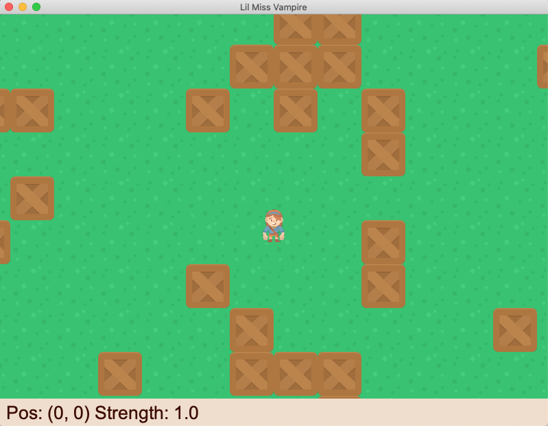
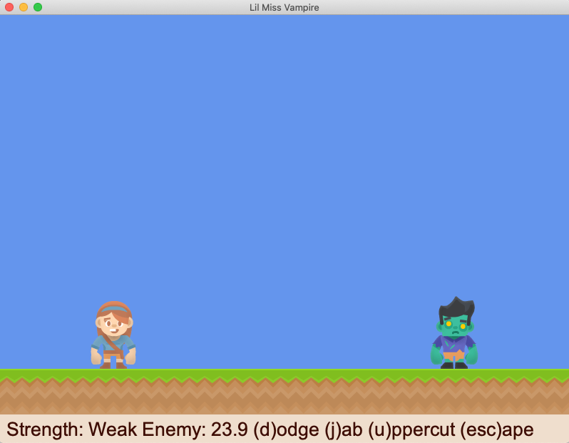

# Lil Miss Vampire
## Introduction





My younger kids and I built this entry for [PyWeek 32](https://pyweek.org/) based on the theme "Neverending".

The key innovations are:

* It has a neverending world. As the player walks along, it picks up tiles and places new ones invisibly. It uses an LRUDict to remember the last million tiles you've seen. This matches real life in that if you go back to a place after 20 years, it'll look different than when you first saw it.
* The user interface was inspired by Super Mario RPG, but the fighting mechanics are purposely realtime. It's a lot like if you were playing Street Fighter, but all you were allowed to do was use a fast punch, a slow punch, or block. It's a little bit like roshambo.

The gameplay:

* As you know, the life of a vampire is neverending. Hence, Lil Miss Vampire can never die. Her goal is the same as every vampire's goal: to grow in strength, which she does by vanquishing enemies.
* As she gets further away from the origin, the enemies get harder. As she gains in strength, her attacks get stronger. If you just walk around, you slowly lose strength.
* Walk around by using the arrow keys. When you're in a battle, there are instructions on the screen.
* There's a fun dynamic where you can get a hint as to what the opponent is going to throw at you, so you can try to counter it. Both attacks and blocks have a cool down period during which you are vulnerable.
* If, for some reason, you can't move in the beginning, just restart the game.

The code:

* The code is pretty pleasant. I made use of lots of new features in the latest Python, and I built a pretty decent developer experience.
* It's built on the excellent [arcade library](https://api.arcade.academy/en/latest/index.html) which has exceptionally good documentation, tutorials, and examples.
* I used type annotations everywhere, and I enforced them via mypy. I made extensive use of `typing.NamedTuple` which gives it a nice, immutable, well-typed flavor.
* I used black to format the code during checkin.
* There are extensive unit tests for the models. And there are git hooks to keep everything sane.
* Running `make iterate` will reformat the code, run mypy to enforce types, run the unit tests, and then launch the game.

Development:

* I built the game with two of my kids, Giovanni and Greggory.

* I walked them through building some of the initial screen elements. Then, I built all the hard parts like the `Geography` class and `TimedWorkflow`.

Limitations:

* Obviously, it would have been better with some custom artwork, some sounds, and a lot more animations.


## Setup

Note that the arcade library requires OpenGL 3.3 and thus won't currently run on a Raspberry Pi.

Install Python 3.9.7. I used pyenv on a Mac, but you can do whatever suits you:

```
brew update && brew upgrade pyenv
pyenv install 3.9.7
# Restarted my shell.
```

Setup a virtualenv using the right version of Python. I used pyenv, but that's optional:

```
pyenv global 3.9.7
python --version
python -m venv ~/.virtualenvs/pyweek32-neverending
pyenv global system
python --version
```

Check out the source code:

```
# Switch to some directory where you can checkout the code.
git clone https://github.com/jjinux/pyweek32-neverending.git
cd pyweek32-neverending
```

Install requirements:

```
# Make sure you're in the directory containing the source code.
. ~/.virtualenvs/pyweek32-neverending/bin/activate
pip install -r requirements.txt
```

## Running

```
. ~/.virtualenvs/pyweek32-neverending/bin/activate
./run_game.py
```

## Developing

```
. ~/.virtualenvs/pyweek32-neverending/bin/activate
make help
make setup_githooks
make iterate
```
